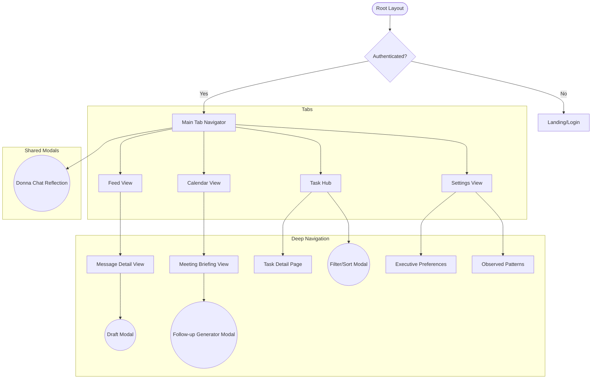

# Donna: Information Architecture (IA)

This document defines the structural hierarchy and navigation model for the Donna executive assistant app, optimized for high-speed decision making.

---

## 1. App Structure Overview

Donna uses a **Tab-Based** primary navigation with **Modal Stacks** for deep-work focus.

### Primary Navigation (Tabs)
1. **Feed (The Dashboard)**: The "Morning Briefing" and live cards.
2. **Calendar**: Daily/Weekly schedule with meeting briefings.
3. **Task Hub**: Centralized view of all approved or pending tasks.
4. **Settings**: Profile, **Executive Preferences** management, and Gmail connection.

---

## 2. Screen Hierarchy Diagram

---

## 3. Detailed Route Map

### (Stack) Root
- `/` -> **LandingPage**: Briefing on what Donna is.
- `/auth` -> **AuthPage**: Gmail OAuth connection.

### (Tabs) Main
- `/dashboard` -> **Dashboard**: The live feed of cards (Urgent/FYI).
- `/calendar` -> **CalendarEventsView**: Chronological meeting list.
- `/tasks` -> **TaskHub**: Kanban or List view of obligations.
- `/settings` -> **SettingsView**: High-level preferences.

### (Stack) Message & Interaction
- `/messages/:id` -> **MessageDetail**: Full thread context, summary, and action bar.
- `/messages/:id/draft` -> **DraftReply**: Focused view for reviewing/editing AI responses.
- `/calendar/:id` -> **MeetingBriefingCard**: Preparation context and attendee insights.

### (Modals / Overlays)
- **Donna Pulse (Chat)**: Floats over all tabs. The "Reflection" space for commands or venting.
- **Precision Panel**: Used for deep editing of **Executive Preferences** or **Decision Patterns**.

---

## 4. Navigation Rules

1.  **Tab Resilience**: Switching tabs preserves the scroll state and entry points.
2.  **Breadcrumb Logic**: Navigating deep (e.g., Feed -> Message -> Draft) always allows a single-tap "Back" to relevant context.
3.  **The "Donna Pulse"**: Accessible via a Swipe-Up or a persistent Floating Action Button (FAB) in the corner—Donna is always one tap away.
4.  **Entry/Exit Transitions**:
    *   **Tabs**: Subtle horizontal slides.
    *   **Modals**: Vertical spring-up from the bottom (Handled/Action states).
    *   **Deep Nav**: Shared element transitions for Cards to Detail views.

---

> [!TIP]
> **Priority for Expo Router**: Use `(tabs)` and `(stacks)` directory structures to mirror this IA, ensuring a clean separation between the main UI and focused interaction layers.
