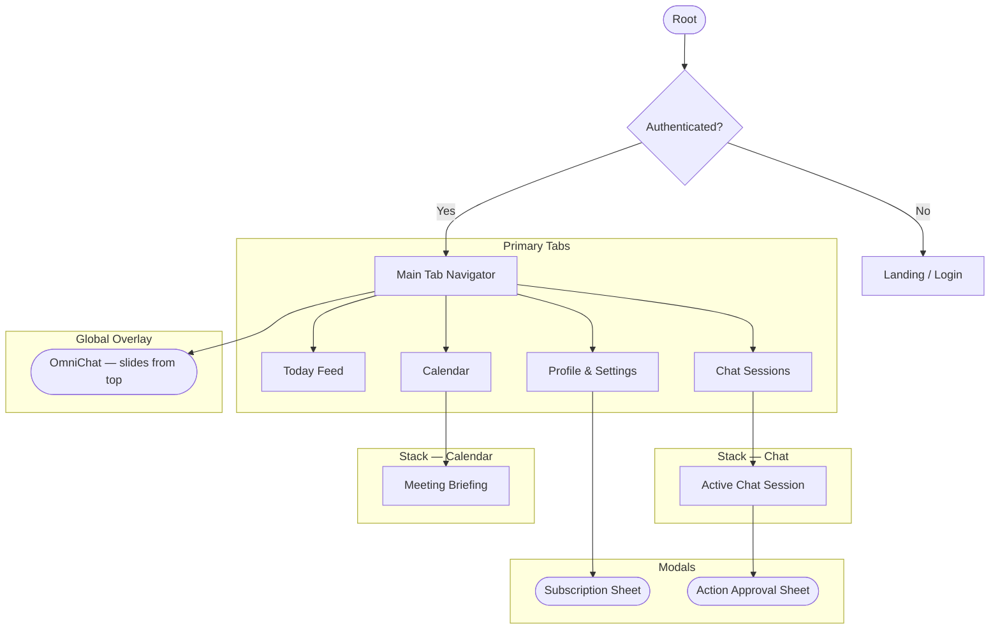

# Teeks: Information Architecture

> *"Three taps to anywhere. One tap to resolve anything."*

This document defines the structural hierarchy and navigation model. Every decision is made around one constraint: **an EA in the middle of a complex day must be able to find, act on, and resolve any item in under 10 seconds.**

---

## 1. Navigation Model

Teeks uses **Tab-Based primary navigation** with **Stack navigation** for deep work and **Modal sheets** for focused actions.

### Primary Tabs (Bottom Bar — 4 items maximum)

| Tab | Label | Purpose |
| :--- | :--- | :--- |
| 1 | **Today** | The primary dashboard — unified feed of what needs attention now |
| 2 | **Chats** | All AI sessions — Action and Reflection |
| 3 | **Calendar** | Chronological meeting view and briefings |
| 4 | **Profile** | Settings, connections, subscription |

**Why 4?** Five tabs creates a choice problem. The user should know immediately where they are going. If the correct tab is not obvious, the architecture is wrong.

### Global Overlay — OmniChat
Teeks is always one swipe or one tap away from a chat interface. The OmniChat overlay slides in from the top. It does not navigate — it overlays. The user does not lose their place.

---

## 2. Screen Hierarchy

---

## 3. Route Map

### Auth Stack
- `/` → **Landing** — what Teeks is, single CTA to connect
- `/auth` → **Auth** — Gmail OAuth, no unnecessary screens

### Tab: Today
- `/today` → **Today Feed** — unified card feed, most urgent first

### Tab: Chats
- `/chat` → **Sessions List** — recent Action and Reflection sessions
- `/chat/:id` → **Active Session** — message thread + input bar

### Tab: Calendar
- `/calendar` → **Calendar View** — chronological meeting list
- `/calendar/:id` → **Meeting Briefing** — context, attendees, prep

### Tab: Profile
- `/profile` → **Profile Sheet** — settings, account, subscription, sign out

### Modals (bottom sheet)
- **Action Card Approval** — invoked in-context from any chat session
- **Subscription management** — invoked from Profile

---

## 4. Navigation Rules

These are non-negotiable.

1. **One primary action per screen.** Every screen has exactly one thing it wants the user to do. If two things compete for attention, one of them is on the wrong screen.

2. **Tab state is preserved.** Switching tabs never resets scroll position, selection state, or form input. The EA may switch tabs mid-action and come back.

3. **Back is always one tap.** No dead ends. The back button is always present in stack navigation. The back gesture (swipe from left) is always enabled.

4. **Modals slide up, stacks slide right.** Motion communicates structure. Up means "this is temporary, overlaid." Right means "I went deeper." Never reverse this.

5. **OmniChat never navigates.** It overlays and dismisses. The user's position in the app is unchanged when OmniChat closes.

6. **Session creation is instant.** Tapping "New chat" must not navigate to a configuration screen. It creates a session immediately and drops the user into the input. One tap, ready to type.

---

> [!IMPORTANT]
> **The 10-second rule**: At any point in the app, the EA must be able to reach, read, and act on any urgent item in under 10 seconds from unlock. Test this with a real device. If it fails, the architecture needs reworking, not the code.
