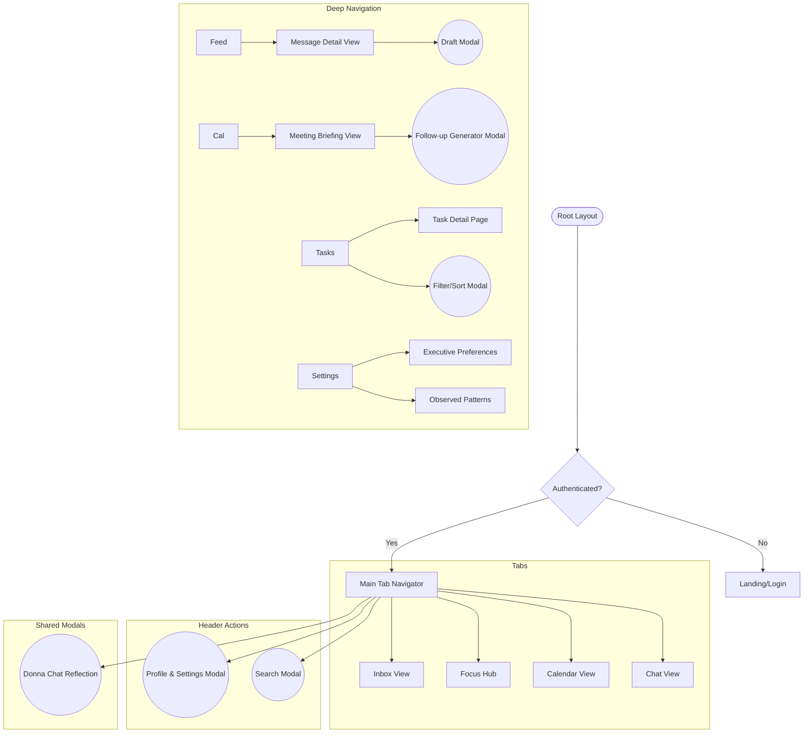

# Donna: Information Architecture (IA)

This document defines the structural hierarchy and navigation model for the Donna executive assistant app, optimized for high-speed decision making.

---

## 1. App Structure Overview

Donna uses a **Tab-Based** primary navigation with **Modal Stacks** for deep-work focus.

### Primary Navigation (Tabs - Bottom Bar)
1. **Inbox**: The centralized feed for all incoming communications and synthesized cards.
2. **Focus**: The task hub for high-priority action items.
3. **Schedule**: Calendar view and meeting briefings.
4. **Chat**: Direct AI interaction and reflection space.

### Secondary Navigation (Global Header)
- **Profile (Avatar)**: Access to **Settings**, User Identity, and Connections (Modal Sheet).
- **Search**: Global search overlay.
- **Notifications**: Activity center.

---

## 2. Screen Hierarchy Diagram

---

## 3. Detailed Route Map

### (Stack) Root
- `/` -> **LandingPage**: Briefing on what Donna is.
- `/auth` -> **AuthPage**: Gmail OAuth connection.

### (Tabs) Main
### (Tabs) Main
- `/index` (Inbox) -> **Inbox**: The primary dashboard feed.
- `/focus` -> **TaskHub**: Kanban or List view of obligations.
- `/calendar` -> **CalendarEventsView**: Chronological meeting list.
- `/chat` -> **ChatView**: Dedicated AI interaction space.
- `/settings` -> **REMOVED** (Now a modal).

### (Stack) Message & Interaction
- `/messages/:id` -> **MessageDetail**: Full thread context, summary, and action bar.
- `/messages/:id/draft` -> **DraftReply**: Focused view for reviewing/editing AI responses.
- `/calendar/:id` -> **MeetingBriefingCard**: Preparation context and attendee insights.

### (Modals / Overlays)
### (Modals / Overlays)
- **Profile & Settings**: Slides up from the bottom when tapping the User Avatar.
- **Donna Pulse (Chat)**: Now integrated as a primary tab, but can also be invoked contextually.
- **Precision Panel**: Used for deep editing of **Executive Preferences** or **Decision Patterns**.

---

## 4. Navigation Rules

1.  **Tab Resilience**: Switching tabs preserves the scroll state and entry points.
2.  **Breadcrumb Logic**: Navigating deep (e.g., Feed -> Message -> Draft) always allows a single-tap "Back" to relevant context.
3.  **The "Donna Pulse"**: Accessible via a Swipe-Up or a persistent Floating Action Button (FAB) in the corner—Donna is always one tap away.
4.  **Entry/Exit Transitions**:
    *   **Tabs**: Subtle horizontal slides.
    *   **Modals**: Vertical spring-up from the bottom (Handled/Action states).
    *   **Deep Nav**: Shared element transitions for Cards to Detail views.

---

> [!TIP]
> **Priority for Expo Router**: Use `(tabs)` and `(stacks)` directory structures to mirror this IA, ensuring a clean separation between the main UI and focused interaction layers.
