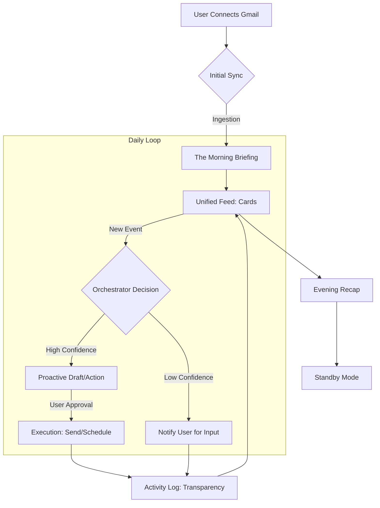

# Donna: Product Flow & User Journey

This document outlines the end-to-end experience for an **Executive Assistant (EA)** using Donna to manage their Executive's life with effortless precision.

---

## 1. The Onboarding Flow (The Handover)

The goal is to transition the EA from "managing mail" to "having a high-performance partner."

1. **The Entry**: EA lands on a minimalist, obsidian-dark page.
2. **The Handover**: EA connects the Executive's Gmail. Donna explains what she looks for: *Context, Commitments, and Chaos.*
3. **The Initial Ingestion**: While syncing, Donna calculates the Executive's current landscape.
4. **The First Brief**: The EA sees their first **Executive Summary**. "I've analyzed 45 unread emails for [Executive Name]. 3 are urgent, 8 are FYI, and I've prepared responses for you to review."

---

## 2. A "Day in the Life" (The Anticipatory Loop)

### 08:00 AM — The Morning Briefing
*   **Trigger**: EA opens the app for the first time.
*   **Donna’s Action**: Presents a unified feed of **Cards** representing the Executive's needs.
*   **User Experience**: High-priority items stay on top. Each card has a "Cerulean Insight" tag: *"The Executive's contact is usually slow on Fridays; I've suggested we push the deadline to Monday."*

### 11:30 AM — The Micro-Intervention
*   **Trigger**: An urgent email arrives from a Board Member.
*   **Donna’s Action**: The Orchestrator detects high-confidence intent.
*   **User Experience**: Notification: *"Board meeting request. I've found a 30min gap at 2 PM that doesn't conflict with your deep work. Drafted a confirmation—send?"*
*   **User Action**: Single-tap [Send]. Donna handles the rest.

### 02:00 PM — The Context Shift
*   **Trigger**: The Executive enters a meeting.
*   **Donna’s Action**: Pulls relevant historical context for the EA to pass along or use in briefings.
*   **User Experience**: EA taps the meeting card. Sees the "Cerulean Summary":
    *   *Context: Budget was approved at $50k last month.*
    *   *Warning: Attendee Sarah hasn't submitted her report to the Executive yet.*

### 05:30 PM — The Evening Handover
*   **Trigger**: End of business hours.
*   **Donna’s Action**: Synthesizes the day's wins for the EA's final report.
*   **User Experience**: *"7 tasks handled for the Executive. 2 replies drafted and sent via your approval. You're clear for the evening."*

---

## 3. Visual Product Flow (Mermaid)

---

## 4. Core Action Flows

### Flow A: Task Management (Approval to Action)
*   **Action**: High-confidence task extracted from an email.
*   **Entry State**: A card in the feed with a `[Cerulean Border]` and an `[Approve]` button.
*   **Steps**:
    1.  User reviews the `Source Snippet` on the card.
    2.  User taps `[Approve]`.
    3.  Donna transitions the card state: The button changes to `[Done]` or `[Reply]`.
    4.  The task is added to the **Task Hub** (`Task` record created in DB).
*   **Exit State**: The card is moved to the "Approved" section of the feed or the **Task Hub**.

### Flow B: The "One-Tap" Communication
*   **Action**: An email requires a response.
*   **Entry State**: A card with a red `Needs Reply` indicator and a pre-generated `[Draft Suggestion]`.
*   **Steps**:
    1.  User taps the `[Draft Suggestion]` to enter **Draft View**.
    2.  User reviews the AI text (which incorporates **Principal Memory** tone).
    3.  User either:
        -   Taps `[Send]` (High-speed exit).
        -   Taps the text to **Edit** (Triggers **Memory Engine** to observe changes).
    4.  Donna sends via `CommunicationModule`.
*   **Exit State**: Confirmation toast: *"Sent. I've archived the thread for you."* Back to Dashboard.

### Flow C: Scheduling Coordination
*   **Action**: Request for a meeting.
*   **Entry State**: Card showing conflicting events and a `[Suggest Times]` button.
*   **Steps**:
    1.  User taps `[Suggest Times]`.
    2.  Donna opens a **Scheduling Panel** with three "Priestly Cerulean" slots that fit the user's `Preferred Meeting Times`.
    3.  User selects one or all slots.
    4.  User taps `[Send Options]`.
*   **Exit State**: Card status changes to `Waiting for Confirmation`.

---

## 5. Interaction Pillars

### I. The "One-Tap" Resolution
Every Donna card must lead to a resolution in 1 tap.
*   **Pattern**: [AI Drafted Action] + [Confirm/Edit]

### II. The Cerulean Filter
Donna never shows "Pending" work. She shows "**Ready**" work that needs a nod.
*   **Concept**: If Donna extracts a task, she shouldn't just list it; she should prepare the draft or calendar invite for a single-tap approval.

### III. Radical Transparency
Despite being anticipatory, Donna is never a "black box" and never acts on your behalf without your review.
*   **The "Shadow" Feed**: A subtle log of what Donna has **prepared** while you were away. *"Drafted 12 newsletters, proposed 'Done' on 3 FYIs."*

### V. The Pattern Tracker
Donna observes repetitions (The "Miranda Effect"). If she sees the user always dismisses emails from a specific sender, she suggests a **Decision Pattern**: *"I've noticed you always archive these. Should I do it for you next time?"*

---

> [!IMPORTANT]
> **Product Goal**: Donna should feel like she is always 15 minutes ahead of the EA, who is 15 minutes ahead of the Executive.
